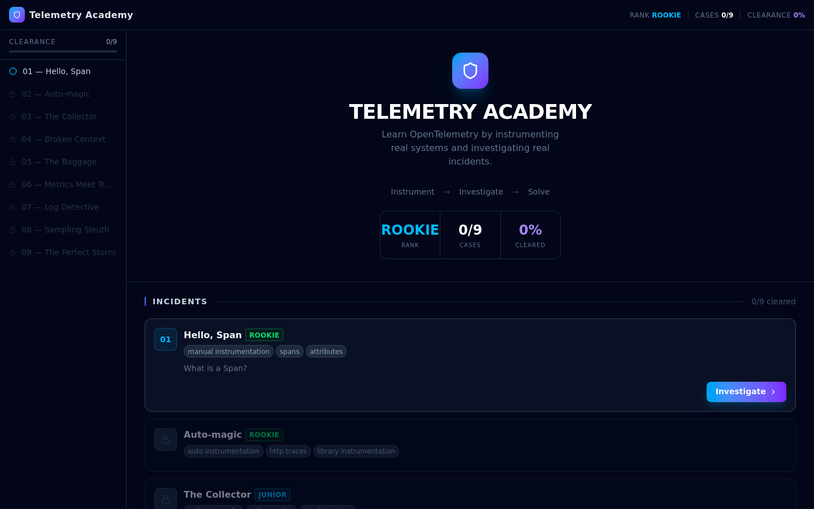

# Telemetry Academy

> Learn OpenTelemetry by doing — instrument real systems, then investigate real incidents.

**Live:** [telemetry.academy](https://telemetry.academy) &nbsp;·&nbsp; **GitHub:** [vitorvasc/telemetry-academy](https://github.com/vitorvasc/telemetry-academy)




---

## What It Is

A gamified, browser-based platform to learn [OpenTelemetry](https://opentelemetry.io) from zero to hero. Each case follows a two-phase workflow that mirrors real observability practice:

1. **Instrument** — add telemetry to a blind system (Python runs in-browser via Pyodide WASM, no backend needed)
2. **Investigate** — use the data you generated to find the root cause of a simulated incident

No account. No backend. Everything runs in your browser.

---

## Quick Start

```bash
git clone https://github.com/vitorvasc/telemetry-academy.git
cd telemetry-academy
npm install
npm run dev
```

Open [http://localhost:5173](http://localhost:5173).

---

## Cases

| # | Case | Concept | Difficulty |
|---|------|---------|------------|
| 1 | Hello, Span | Manual instrumentation | 🟢 Rookie |
| 2 | Auto-magic | Auto-instrumentation | 🟢 Rookie |
| 3 | The Collector | Collector pipeline / YAML config | 🔵 Junior |
| 4 | Broken Context | Context propagation | 🔵 Intermediate |
| 5 | The Baggage | Baggage attributes | 🔵 Intermediate |
| 6 | Metrics Meet Traces | Signal correlation | 🟣 Senior |
| 7 | Log Detective | Structured logging | 🟣 Senior |
| 8 | Sampling Sleuth | Head/tail sampling | 🟣 Senior |
| 9 | The Perfect Storm | Cascading failure diagnosis | ⭐ Expert |

---

## Architecture

- **Runtime:** Python executes in a Pyodide Web Worker (WASM) — no server, no Docker
- **OTel bridge:** Custom `JSSpanExporter` sends spans from Python → JavaScript via `postMessage`
- **Validation:** 8 declarative check types evaluate spans in real time with progressive hints
- **Investigation:** Synthetic traces, logs, and a rules-based root cause engine
- **Persistence:** `localStorage` only — progress saved locally, no auth required

```
src/
├── cases/<id>/          # case.yaml + setup.py (auto-discovered at build time)
├── components/          # React UI (TraceViewer, LogViewer, CodeEditor…)
├── data/                # caseLoader.ts, phase2.ts
├── hooks/               # useCodeRunner, useAcademyPersistence
├── lib/                 # validation.ts, rootCauseEngine.ts, spanTransform.ts
└── workers/             # python.worker.ts + setup_telemetry.py
```

---

## Tech Stack

| Layer | Tech |
|-------|------|
| Frontend | React 19 + TypeScript + Vite |
| Styling | Tailwind CSS v4 |
| Editor | Monaco Editor (`@monaco-editor/react`) |
| Python runtime | Pyodide 0.29.3 (WASM) |
| OTel SDK | `opentelemetry-api` + `opentelemetry-sdk` (via micropip) |
| Icons | Lucide React |
| Routing | Wouter |
| Layout | react-resizable-panels |

---

## Adding a New Case

Cases are defined as YAML + Python files and auto-discovered at build time — no TypeScript changes required.

```
src/cases/my-new-case/
├── case.yaml   # content, validations, root cause options
└── setup.py    # initial Python code shown to the student
```

See [docs/ADDING_CASES.md](docs/ADDING_CASES.md) for the full schema reference and examples.

---

## Contributing

Contributions are welcome! See [CONTRIBUTING.md](CONTRIBUTING.md) for the full guide.

The fastest way to contribute is to **author a new case** — see [docs/ADDING_CASES.md](docs/ADDING_CASES.md).

---

## Related Projects

- [SDPD](https://sdpd.live) — System Design Police Department (inspiration for the investigation format)
- [OpenTelemetry Koans](https://otel.mreider.com) — contemplative OTel trace visualization
- [OpenTelemetry Demo](https://github.com/open-telemetry/opentelemetry-demo) — Official OTel reference application

---

## License

MIT — see [LICENSE](LICENSE) for details.

---

*Built by [Vitor Vasconcellos](https://github.com/vitorvasc)*
